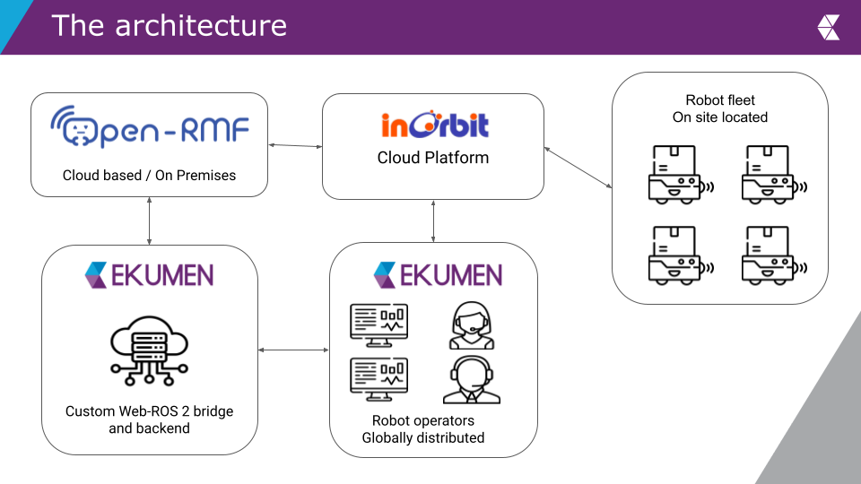
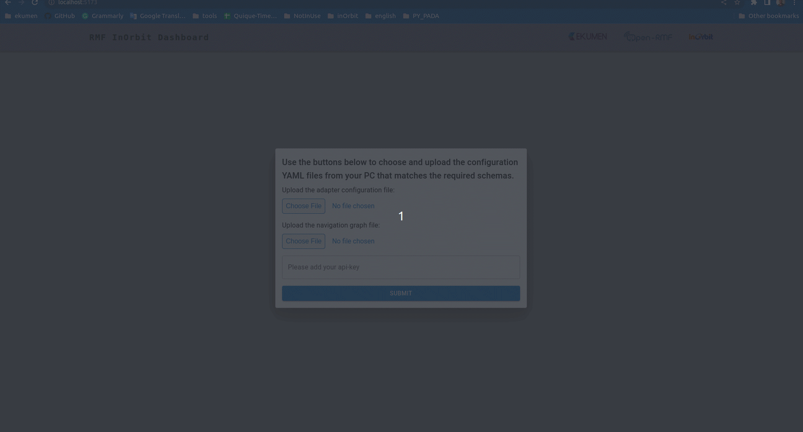
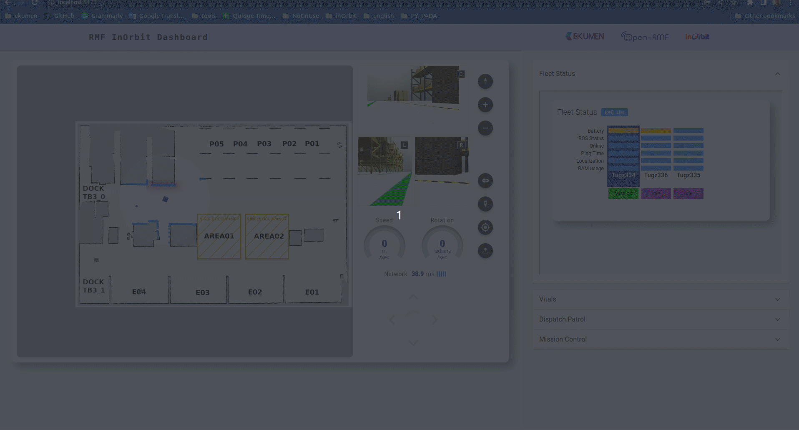
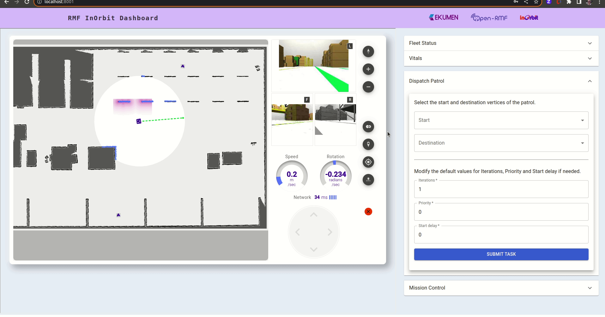

# RMF InOrbit Dashboard

_Web app to manage and visualize fleets of robots._

This package contains web tools to visualize the state of your fleet, and monitor
the tasks assigned via OpenRMF to the fleet. It consumes the InOrbit REST API and 
Embeds to power the web dashboard and subscribes to websocket clients from various
OpenRMF ROS 2 nodes. The following is a simple diagram that shows the architecture.



InOrbit manages the robots and connects with OpenRMF via the OpenRMF InOrbit Fleet Adapter.
This dashboard consists in a frontend and a backend. The backend offers a websocket server
that receives client connections from different OpenRMF nodes including the adapter. It
replicates messages and offers them to the dashboard so those can be visualized in the
frontend. Also, it is capable of requesting patrol tasks through the ROS 2 interface.
The frontend merges InOrbit Embeds to visualize the site and get fleet specific data on
top of robot sensor data. Use the Dispatch Patrol and Mission Control panels to request tasks
and visualize their updates.

TODO: add gif showing the full interaction.
## Environment

- ROS2 Humble + Ubuntu 22.04
- Python 3.10
- NodeJs version: v18.14.12 (you need to have NodeJs v14 or newer to use Vite frontend tooling.)
- React v18.2

## Configure your workspace

Create a ROS 2 workspace and clone the following repositories in the `src` folder:

```
mkdir src
git clone https://github.com/inorbit-ai/rmf_inorbit_examples src/rmf_inorbit_examples
git clone https://github.com/inorbit-ai/ros_amr_interop src/ros_amr_interop
git clone https://github.com/ekumenlabs/rmf_inorbit_dashboard.git
```

And checkout [`ros_amr_interop`](https://github.com/inorbit-ai/ros_amr_interop) to the
[`humble-devel`](https://github.com/inorbit-ai/ros_amr_interop/tree/humble-devel) branch:

```
cd src/ros_amr_interop
git checkout humble-devel
```

Note that we will use [`rmf_inorbit_fleet_adapter`](https://github.com/inorbit-ai/ros_amr_interop/tree/humble-devel/rmf_inorbit_fleet_adapter)
package from this repository.

Also, we bring in [rmf_inorbit_examples](https://github.com/inorbit-ai/rmf_inorbit_examples) to walk through a complete demo.
Other projects are expected to have a concrete implementation based on [`rmf_inorbit_template`](https://github.com/inorbit-ai/rmf_inorbit_examples/tree/main/rmf_inorbit_template) with their own configurations.

For the full demonstration purposes, please revisit the requirements of each repository for extra packages.
In particular, take a look at the installation requirements of [`rmf_fleet_adapter`](https://github.com/inorbit-ai/ros_amr_interop/tree/humble-devel/rmf_inorbit_fleet_adapter#workspace-setup) and [`rmf_inorbit_demo`](https://github.com/inorbit-ai/rmf_inorbit_examples/tree/main/rmf_inorbit_demos#environment-setup).

We recommend using the provided docker environment. For a more detailed non-docker setup, please check the rmf_fleet_adapter readme document.
The docker container for this example is in:
```
src/rmf_inorbit_dashboard/docker
```
## Build and run the docker container.
```
./src/rmf_inorbit_dashboard/docker/build.sh
./src/rmf_inorbit_dashboard/docker/run.sh
```

From this point, continue the setup in the docker workspace "your@computer:~/ws$"

## Install dependencies

### ROS 2 dependencies

Install all of the dependencies available via rosdep:

```
rosdep install --from-paths src --rosdistro humble -y --ignore-src
```

### Backend dependencies

Some specific packages need to meet certain version requirements. It is recommended to run:

```
pip3 install -r src/rmf_inorbit_dashboard/requirements.txt
```

### Frontend dependencies

Check if you have NODE installed and which version:

```
node --version
```
If you don't have an installed version of NodeJs, we recommend installing the latest official LTS version here: [nodejs.org/en/](https://nodejs.org/en/).

If you need to manage different versions of NodeJs for other projects on your local machine, we recommend using NVM.
You can find a detailed installation guide here: [github.com/nvm-sh/nvm](https://github.com/nvm-sh/nvm)

Both will work, anyway we think nvm is easier to use.
Install:
```
curl -o- https://raw.githubusercontent.com/nvm-sh/nvm/v0.39.3/install.sh | bash
```
Config:
```
export NVM_DIR="$([ -z "${XDG_CONFIG_HOME-}" ] && printf %s "${HOME}/.nvm" || printf %s "${XDG_CONFIG_HOME}/nvm")"
[ -s "$NVM_DIR/nvm.sh" ] && \. "$NVM_DIR/nvm.sh"
```
Download and "use" a node version:
```
nvm install <latest LTS e.g. 18>
nvm use 18
```
Check again if you have NODE installed and which version:
```
node --version
```
Move to the web dashboard folder to install `npm` dependencies:

```
cd src/rmf_inorbit_dashboard/rmf_inorbit_dashboard/client/web-dashboard/
npm install
```

## Build the package

The Python package is configured to also build the front end assets by calling `npm`.
Note that it'll create a folder called `static` in which it will store all the generated
assets there. This folder and its contents will be pruned every time the package is built
and installed. Assets are later installed in the appropriate directory for distribution.

You can use the general colcon workflow:

```
colcon build --packages-up-to rmf_inorbit_dashboard
```

To see the full build output:

```
colcon build --packages-up-to rmf_inorbit_dashboard --event-handlers console_direct+
```

When building the demo, also make sure to build those packages. You can run the following:

```
colcon build --packages-up-to rmf_inorbit_dashboard rmf_inorbit_fleet_adapter rmf_inorbit_demos --event-handlers console_direct+
```

### Frontend linter

Eslint has been preconfigured in the project, and scripts were added in `rmf_inorbit_dashboard/client/web-dashboard/package.json` as well.

To see the style errors run:

```
cd src/rmf_inorbit_dashboard/rmf_inorbit_dashboard/client/web-dashboard/
npm run lint
```

If you collaborate on this project, please run the following script to automatically fix all style issues before pushing to the repo:

```
cd src/rmf_inorbit_dashboard/rmf_inorbit_dashboard/client/web-dashboard/
npm run lint:fix
```
## Launch

Use `server.launch.py` to launch both services at once. You may need to source the install space after building.

```
source ./install/setup.bash
ros2 launch rmf_inorbit_dashboard server.launch.py
```

To inspect the different arguments, please add `--show-args`:

```
ros2 launch rmf_inorbit_dashboard server.launch.py --show-args
Arguments (pass arguments as '<name>:=<value>'):

    'rest_port':
        Port at which the server will expose the REST API
        (default: '8001')

    'ws_port':
        Websocket server port
        (default: '8000')

    'ws_interface':
        Interface for the websocket server to listen in
        (default: 'localhost')
```

### Launching the demo

When running the demo, make sure you follow the instructions described in
the [environment setup](https://github.com/inorbit-ai/rmf_inorbit_examples/tree/main/rmf_inorbit_demos#environment-setup)
and [starting a demo](https://github.com/inorbit-ai/rmf_inorbit_examples/tree/main/rmf_inorbit_demos#environment-setup)
to start OpenRMF core, the OpenRMF InOrbit Fleet adapter and the proper configurations of the demo.

Once you have your InOrbit account properly configured, you are required to set twice an [InOrbit API Key](https://developer.inorbit.ai/docs#authentication).
These keys are used in the RMF InOrbit Fleet Adapter and to access the [InOrbit Embeds]((https://developer.inorbit.ai/docs?hsCtaTracking=79b60c18-3301-4d2f-b0c0-e37b167dfeeb%7Cf312850b-5580-4c32-9c38-89c8935d4aff#embeds)).
When setting these InOrbit API Keys for your own account and the dashboard, make sure it allows to
view the monitored robots.
When running the demo, make sure to refer to the [account setup](https://github.com/inorbit-ai/rmf_inorbit_examples/blob/main/rmf_inorbit_demos/README.md#account-setup)
or obtain the keys.

You need two separate workspaces in the same docker container to launch the demo and the dashboard. You can use [Tmux]((https://github.com/tmux/tmux/wiki)) for this purpose.

```
echo "export INORBIT_API_KEY=<your api key>" >> ~/.bashrc
source ~/.bashrc
```

And launch the demo:

```
source ./install/setup.bash
ros2 launch rmf_inorbit_demos warehouse.launch.xml
```

Then, you need to launch the servers:

```
ros2 launch rmf_inorbit_dashboard server.launch.py
```

Now, point your browser to `http://127.0.0.1:8001` and you'll be prompted to include
the fleet adapter, navigation graph and InOrbit Embeds API key as the following shows.



After that, you will see that the InOrbit Embeds load and you can see the map, the fleet
status and vitals of the robots.



After that, you will be able to Dispatch Patrol tasks and use the Mission Control component
to visualize the lifecycle of those.



## Server description

### REST API server

Exposes an endpoint for task dispatching and serves static assets.
You can choose to use the dashboard for dispatching tasks, or a utility like Postman or CURL.
#### Launch

```
$ ros2 launch rmf_inorbit_dashboard rest_server.launch.py --show-args
Arguments (pass arguments as '<name>:=<value>'):

    'rest_port':
        Port at which the server will expose the REST API
        (default: '8001')
```

#### Usage

Once launched, go to `http://127.0.0.1:8001` (or use the specific port of your choice) in your browser.
You will see the RMF InOrbit Dashboard.

To inspect the API documentation, go to `http://127.0.0.1:8001/docs/`. You can also download the OpenAPI
specification from `http://127.0.0.1:8001/api/openapi.json`.

When the server receives a post request to `/submit_task` a ROS2 service client sends the message to RMF.
The result of the operation is then returned. The WS connection can then be used to monitor tasks.

### Websocket server

The InOrbit Fleet Adapter will setup a websocket client when a value is given for its `server_uri` launch argument. The websocket server should listen at the same port the clients will try to connect. The dashboard should be set up to connect to the same port.

#### Launch

```
$ ros2 launch rmf_inorbit_dashboard ws_server.launch.py --show-args
Arguments (pass arguments as '<name>:=<value>'):

    'ws_port':
        Websocket server port
        (default: '8000')

    'ws_interface':
        Interface for the websocket server to listen in
        (default: 'localhost')
```

#### Launch the test websocket client

It will print out any message the server sends to it. You can also write and send messages in the same console by typing anything and pressing `Enter`.

```
$ python3 src/rmf_inorbit_dashboard/server/test/ws_test_client.py -h
usage: ws_test_client.py [-h]
                         [-u URI]

Prints everything the server sends to it

options:
  -h, --help   show this help
               message and exit
  -u URI, --uri URI
               Server URI. Default:
               "ws://localhost:8000"
```

## Contributing

Please see the [CONTRIBUTING](CONTRIBUTING) document.
## License

[](LICENSE)
